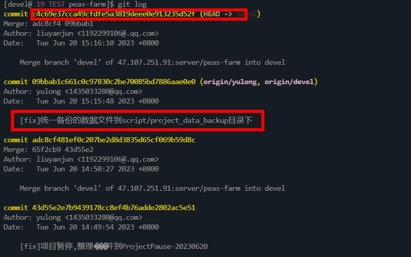
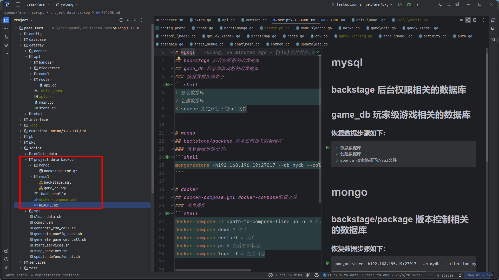
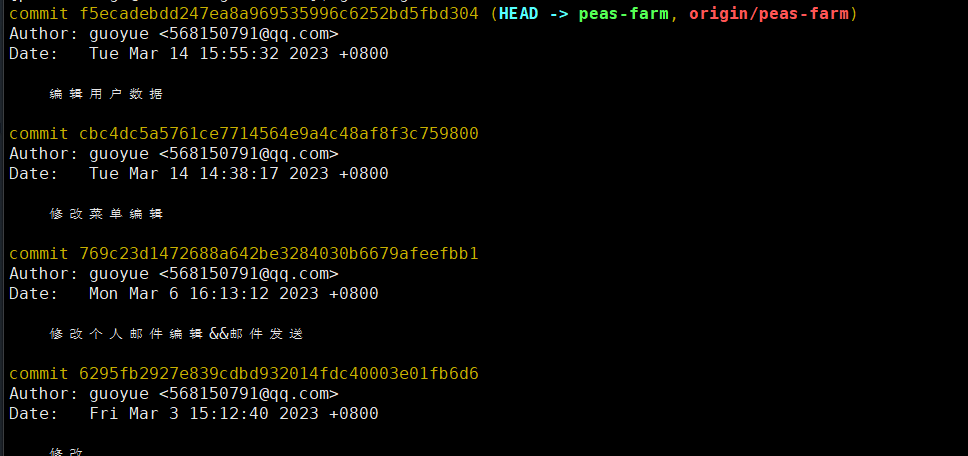
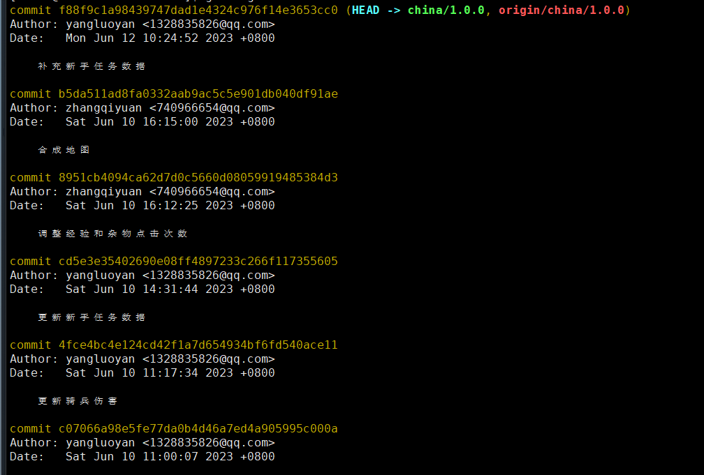

- server
	- 机器
		- 内网：192.168.196.19
		- 外网：39.103.146.23
			- devel
	- 仓库
		- git@47.107.251.91:server/peas-farm.git
		- devel
		- commitID
			- c4c69e37cca49cfdfe5a3819deee0e913235d52f
			- 
			- 
	- 后台
		- git@gitee.com:letuiwl/new-game-admin.git
		- peas-farm
		- commitID
			- f5ecadebdd247ea8a969535996c6252bd5fbd304
			- 
			  id:: 649a561e-1419-4b79-865c-1c1044384ac1
	- 协议
		- git@47.107.251.91:group_dddcz/peas-farm-proto.git
		- master
		- commitID
			- e04364342c4986c78128706d9ff63d50d0879864
			- 
	- 数值
		- git@47.107.251.91:group_dddcz/datatable-for-gam.git
		- china/1.0.0
		- commitID
			- f88f9c1a98439747dad1e4324c976f14e3653cc0
			- 
- 开发总结
	- 待开发
		- 里程碑任务(任务统计)未开发
	- 已开发
		- 一期所有
-
-
-
- docker-compose.yml
- ```
  version: "2"
  
  services:
    mysql:
      image: mysql:8.0
      container_name: mysql
      restart: always
      command: --default-authentication-plugin=mysql_native_password
      ports:
        - "3306:3306"
      volumes:
        - /data/mysql:/var/lib/mysql
          #  - /data/my.cnf:/etc/my.cnf
      environment:
          # - MYSQL_ROOT_PASSWORD=8dExSAPdCG
          - MYSQL_ROOT_PASSWORD=123456
      privileged: true
  
    zookeeper:
      image: bitnami/zookeeper:3.8.1
      container_name: zookeeper
      restart: always
      ports:
        - "2181:2181"
      volumes:
        #- /data/zoo.cfg:/conf/zoo.cfg
        - /data/zookeeper/data:/data
        - /data/zookeeper/datalog:/datalog
        - /data/zookeeper/logs:/logs
      environment:
        - ALLOW_ANONYMOUS_LOGIN=yes
  
    kafka:
      image: bitnami/kafka:3.2.0
      container_name: kafka
      restart: always
      depends_on:
        - zookeeper
      volumes:
        - /etc/localtime:/etc/localtime
        - /data/kafka:/bitnami/kafka
          # sudo chown -R 1001:1001  /data/kafka
      ports:
        - "9092:9092"
      environment:
        - KAFKA_LISTENERS=PLAINTEXT://0.0.0.0:9092
        #  - KAFKA_ADVERTISED_LISTENERS=PLAINTEXT://172.16.123.181:9092
        - KAFKA_ADVERTISED_LISTENERS=PLAINTEXT://172.17.0.1:9092
        - KAFKA_CFG_ZOOKEEPER_CONNECT=zookeeper:2181
        - ALLOW_PLAINTEXT_LISTENER=yes
        - KAFKA_BROKER_ID=1
  
    etcd:
      image:  docker.io/bitnami/etcd:3.5
      container_name: etcd
      ports:
        - "2379:2379"
        - "2380:2380"
      environment:
        - ALLOW_NONE_AUTHENTICATION=yes
        - ETCD_ADVERTISE_CLIENT_URLS=http://0.0.0.0:2379
        - ETCD_ENABLE_V2=true
        - ETCD_LISTEN_CLIENT_URLS= http://0.0.0.0:2379
      volumes:
        - /data/etcd:/bitnami/etcd
          sudo chown -R 1001:1001  /data/etcd/
    mongo:
      image: mongo:5.0
      container_name: mongo
      restart: always
      ports:
        - "27017:27017"
      volumes:
      #- /data/mongo/conf:/etc/mongo 
      - /data/mongo/db:/data/db 
      - /data/mongo/configdb:/data/configdb 
    redis-20:
      image: redis:6.0
      container_name: redis-20
      command: redis-server --include /usr/local/etc/redis/redis.conf
      restart: always
      ports:
        - "6020:6379"
      volumes:
        - /data/redis/6020/:/data
        - /data/redis/6020/:/usr/local/etc/redis/
        - /etc/localtime:/etc/localtime:ro
  
    redis-21:
      image: redis:6.0
      container_name: redis-21
      command: redis-server --include /usr/local/etc/redis/redis.conf
      restart: always
      ports:
        - "6021:6379"
      volumes:
        - /data/redis/6021/:/data
        - /data/redis/6021/:/usr/local/etc/redis/
        - /etc/localtime:/etc/localtime:ro
  
    redis-22:
      image: redis:6.0
      container_name: redis-22
      command: redis-server --include /usr/local/etc/redis/redis.conf
      restart: always
      ports:
        - "6022:6379"
      volumes:
        - /data/redis/6022/:/data
        - /data/redis/6022/:/usr/local/etc/redis/
        - /etc/localtime:/etc/localtime:ro
  
    redis-23:
      image: redis:6.0
      container_name: redis-23
      command: redis-server --include /usr/local/etc/redis/redis.conf
      restart: always
      ports:
        - "6023:6379"
      volumes:
        - /data/redis/6023/:/data
        - /data/redis/6023/:/usr/local/etc/redis/
        - /etc/localtime:/etc/localtime:ro
  
    redis-24:
      image: redis:6.0
      container_name: redis-24
      command: redis-server --include /usr/local/etc/redis/redis.conf
      restart: always
      ports:
        - "6024:6379"
      volumes:
        - /data/redis/6024/:/data
        - /data/redis/6024/:/usr/local/etc/redis/
        - /etc/localtime:/etc/localtime:ro
  ```