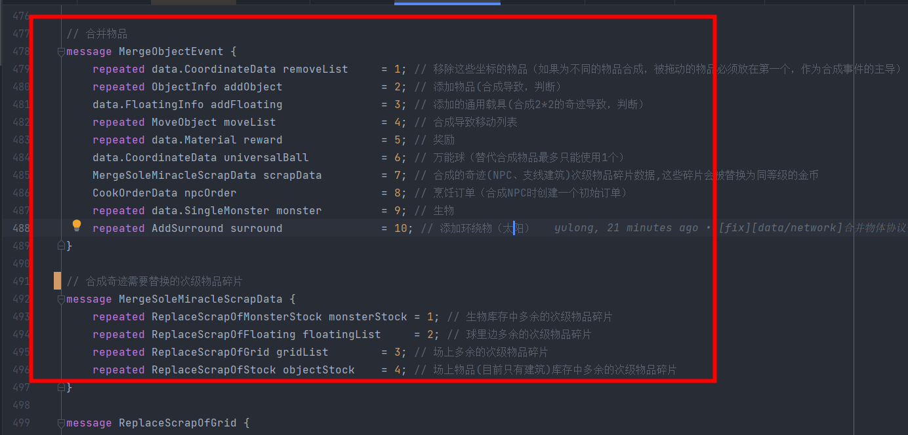
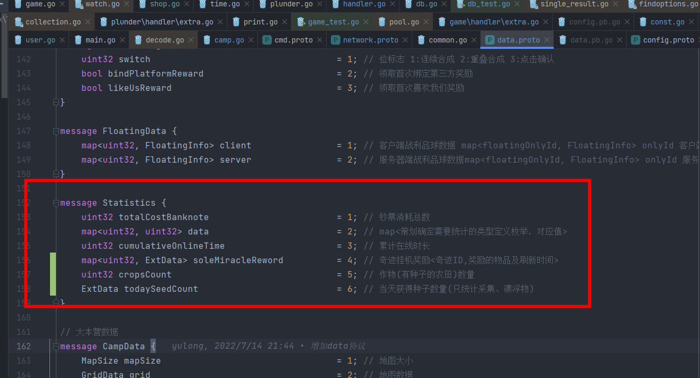

- 支线建筑合成
	- 
	- 说明：合成支线建筑奇迹(2*2物品)将其他次顶级碎片兑换为同等级的金币(同NPC逻辑)--场上放不下时放到球中
	- #### 协议：修改 卢洋
		- MergeSoleMiracleScrapData
- 建筑
	- #### 协议：增加 卢洋
		- soleMiracleReword
	- 主线建筑
		- 四合完进入充能
			- 说明：底座四合完成后直接充能完毕并且头顶产生气泡
			- ```
			  // 向日葵奇迹线:次级物品->四合一建造事件->(正常)->点击事件->(充能)->充能结束事件->(产生净化球库存)->释放物品库存事件->(充能)->充能结束事件...
			  // 建筑奇迹线:次级物品->四合一建造事件->(正常)->释放库存事件->(充能)->立即完成事件->(正常)->释放物品库存事件...
			  // 大资源奇迹线:采集物品事件->(建造)->立即完成事件->(正常)->采集物品事件...
			  ```
	- 支线建筑
		- 不需要建造,只有合成属性
- 当天获得种子数量
	- 
	- #### 协议：修改  叶涛
		- todaySeedCount