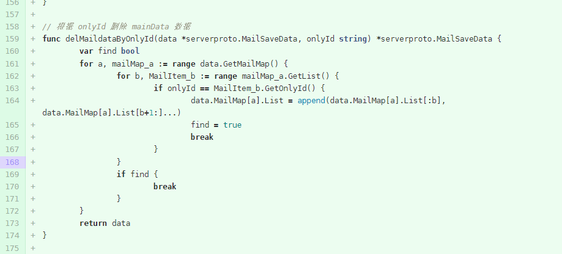
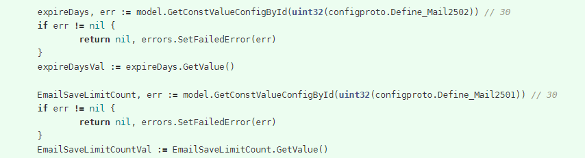

- 命名
	- 不要用没有实际意义的词语命名,变量或者函数尽可能做到见名知意
		- deleteMailNew
		- DeleteMailNewEvent
		- DeleteMailItemNew
	- 变量名可以简短一些
		- hasAttachUnDelEmail=>attachEmail
		- hasNoAttachUnDelEmail=>noAttachEmail
	- 命名规范保持一致
		- t := uint32(MailItem.GetType())
	- 重复的使用的定义变量
		- emailSendTime+int64(expireDaysVal)*3600*24
			- 建议定义一个白能量
		- int64(time.Now().Unix())
			- 有多处使用，如果不定义变量这个值还一致吗
	- 遍历
		- 建议遍历数据的变量使用k=>v、kk=>vv...的结构
		- 
- 函数
	- 重复的功能可以封装一下函数
		- 
	-