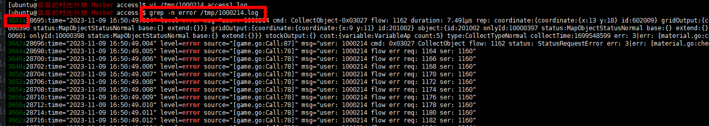

- <s>恢复体力错误!!!</s>
	- ```
	  logs/game-0-2023-11-10T01-40-53.178.log:85748:time="2023-11-10 00:58:28.205" level=error msg="user: 1000110 cmd: RestoreAp-0x03107 flow: 49 duration: 20.581µs rep: output:{variable:VariableAp count:1} restoreTime:1699577908 err: 3|err: [shop.go:checkRestoreAp:    977] err: restoration of ap restoreTime diff: 54 < 179"                                                                                                                                                                                                             
	    2 logs/game-0-2023-11-10T01-40-53.178.log:85749:time="2023-11-10 00:58:28.205" level=error source="[game.go:Call:87]" msg="user: 1000110 cmd: 0x03107 RestoreAp flow: 49 status: StatusRequestError err: 3|err: [shop.go:checkRestoreAp:977] err: restoration of ap re    storeTime diff: 54 < 179"
	  ```
	- 原因：
		- 1、玩家通过其他方式获得额外体力上限(购买月卡、皇冠等级提升)加到玩家本身等级，此时玩家等级提升，应该是减去上一级体力上限，然后加上新一级的体力上限
			- 服务端解决：
				- <s>玩家等级提升时，总体力上限减去上一级体力上限，然后加上新一级的体力上限</s>
				- <s>重复购买月卡只增加一次体力上限</s>
		- 2、玩家体力上限增加应该开始恢复体力，需要客户端给到时间
			- 客户端配合服务端一起解决
- <s>跳过战斗宝箱时间报错</s>
	- ```
	   logs/game-1-2023-11-10T01-07-23.200.log:16270:time="2023-11-09 23:48:58.398" level=error msg="user: 1000110 cmd: FinishPlunderBox-0x03095 flow: 301 duration: 71.752µs rep: index:2 finishTime:1699573738 cost:{variable:VariableDiamond count:9} err: 3|err: [plund    erBox.go:checkFinishPlunderBox:110] finish plunder box index: 2 need diamond: 8 cli: index:2 finishTime:1699573738 cost:{variable:VariableDiamond count:9}"
	   15 logs/game-1-2023-11-10T01-07-23.200.log:16271:time="2023-11-09 23:48:58.398" level=error source="[game.go:Call:87]" msg="user: 1000110 cmd: 0x03095 FinishPlunderBox flow: 301 status: StatusRequestError err: 3|err: [plunderBox.go:checkFinishPlunderBox:110] fini    sh plunder box index: 2 need diamond: 8 cli: index:2 finishTime:1699573738 cost:{variable:VariableDiamond count:9}"
	  
	  ```
	- 原因
		- 计算兑换钻石使用的时间应该与客户端保持一致，不能使用当前时间
			- 服务端解决
				- <s>使用客户端给的完成时间</s>
- <s>恢复体力超出上限</s>
	- ```
	  logs/game-1-2023-11-10T01-07-23.200.log:65831:time="2023-11-10 00:24:12.124" level=error msg="user: 1000110 cmd: RestoreAp-0x03107 flow: 707 duration: 18.931µs rep: output:{variable:VariableAp count:1} restoreTime:1699575851 err: 3|err: [shop.go:checkRestoreAp    :951] err: restoration of ap cannot exceed the upper limit"
	   17 logs/game-1-2023-11-10T01-07-23.200.log:65832:time="2023-11-10 00:24:12.125" level=error source="[game.go:Call:87]" msg="user: 1000110 cmd: 0x03107 RestoreAp flow: 707 status: StatusRequestError err: 3|err: [shop.go:checkRestoreAp:951] err: restoration of ap c    annot exceed the upper limit"
	  
	  ```
	- 原因：由于上边第一个错误导致的
		- 服务端解决
			- 已处理
- 玩家体力不足仍然采集
	- ```
	  logs/game-0-2023-11-09T18-56-07.880.log:28695:time="2023-11-09 16:50:49.004" level=error msg="user: 1000214 cmd: CollectObject-0x03027 flow: 1162 duration: 7.491µs rep: coordinate:{coordinate:{x:13 y:18} id:602009} gridOutput:{coordinate:{coordinate:{x:9 y:12}     id:201001} object:{id:201001 onlyId:10000396 status:MapObjectStatusNormal base:{} extend:{}}} gridOutput:{coordinate:{coordinate:{x:9 y:11} id:201002} object:{id:201002 onlyId:10000397 status:MapObjectStatusNormal base:{} extend:{}}} gridOutput:{coordinate:{c    oordinate:{x:7 y:9} id:100601} object:{id:100601 onlyId:10000398 status:MapObjectStatusNormal base:{} extend:{}}} stockOutput:{} cost:{variable:VariableAp count:5} type:CollectTypeNormal collectTime:1699548599 err: 3|err: [material.go:checkCollectDeductAp:838]     err: deduct: 5 more than cur: 0"
	   46 logs/game-0-2023-11-09T18-56-07.880.log:28696:time="2023-11-09 16:50:49.004" level=error source="[game.go:Call:87]" msg="user: 1000214 cmd: 0x03027 CollectObject flow: 1162 status: StatusRequestError err: 3|err: [material.go:checkCollectDeductAp:838] err: dedu    ct: 5 more than cur: 0"
	  
	  ```
	- 原因：体力物资不一致造成的
	- 排查
		- 
		- 
- 购买商品物资不足
	- ```
	  logs/game-1-2023-11-09T04-17-43.227.log:53421:time="2023-11-08 13:57:43.861" level=error msg="user: 1000082 cmd: BuyShopItem-0x03305 flow: 49 duration: 32.05µs rep: type:1 id:201 supplies:{variable:VariableMoney count:45} object:{coordinate:{coordinate:{x:11 y    :7} id:520301} object:{id:520301 onlyId:10000034 status:MapObjectStatusNormal base:{} extend:{}}} err: 3|err: [material.go:checkDeductMoney:398] err: deduct: 45 more than cur: 1"                                                                                  
	  125 logs/game-1-2023-11-09T04-17-43.227.log:53422:time="2023-11-08 13:57:43.861" level=error source="[game.go:Call:87]" msg="user: 1000082 cmd: 0x03305 BuyShopItem flow: 49 status: StatusRequestError err: 3|err: [material.go:checkDeductMoney:398] err: deduct: 45 more than cur: 1"
	  ```
		- 原因：目前上不确定物资是客户端还是服务端某个操作物资不一致
			- 解决方案：
				- 需要提取客户端日志一起排查
- 战斗宝箱不存在
	- ```
	  logs/game-1-2023-11-09T12-01-20.059.log:62882:time="2023-11-09 07:49:06.264" level=error msg="user: 1000075 cmd: FinishPlunderBox-0x03095 flow: 1731 duration: 85.073µs rep: index:1 finishTime:1699516145 cost:{variable:VariableKey count:1} err: 3|err: [plunderB    ox.go:checkFinishPlunderBox:130] err: user: 1000075 finish plunder box next index: 0 not exist"
	  153 logs/game-1-2023-11-09T12-01-20.059.log:62883:time="2023-11-09 07:49:06.264" level=error source="[game.go:Call:87]" msg="user: 1000075 cmd: 0x03095 FinishPlunderBox flow: 1731 status: StatusRequestError err: 3|err: [plunderBox.go:checkFinishPlunderBox:130] err    : user: 1000075 finish plunder box next index: 0 not exist"
	  ```
	- 原因：
		- 玩家使用钻石跳过完成战斗宝箱时，客户端发送的下一个战斗宝箱不存在
			- 客户端解决
				- 客户端检测错误，此时玩家有下一个未完成的战斗宝箱
- 内购商店
	- 订单创建时间命名不合理，使用完成时间更合理一些
- 刷新每日任务
	- ```
	  logs/game-0-2023-11-13T00-29-06.352.log:52442:time="2023-11-13 00:00:00.182" level=error source="[game.go:Call:87]" msg="user: 1000699 cmd: 0x03601 RefreshDailyTask flow: 3118 status: StatusRequestError err: 3|err: [task.go:checkRefreshTaskTime:71] err: nextRefreshTime err req: 1699833600 < ser: 1699920000"
	  ```
- 完成每日任务
	- ```
	  logs/game-0.log:52108:time="2023-11-13 03:06:18.485" level=error source="[game.go:Call:87]" msg="user: 1001222 cmd: 0x03615 FinishMainTask flow: 2412 status: StatusRequestError err: 3|err: [task.go:checkMainTask:529] err: mainTask: 3022 process: 2 < limit: 3"
	  ```
- 购买体力礼包
	- ```
	  logs/game-1-2023-11-10T06-20-31.392.log:111683:time="2023-11-10 06:09:34.081" level=error source="[game.go:Call:87]" msg="user: 1000436 cmd: 0x03101 BuyApGift flow: 59 status: StatusRequestError err: 3|err: [material.go:checkDeductDiamond:248] err: diamond not enough cur: 130 value: 180 "
	  ```
- 移动物体
	- ```
	  logs/game-1-2023-11-12T21-05-10.735.log:81146:time="2023-11-12 20:49:17.163" level=error source="[game.go:Call:87]" msg="user: 1000530 cmd: 0x03011 MoveObject flow: 3058 status: StatusIdError err: 6|err: [camp.go:checkMoveObjectList:448] err: grid coordinate: x:14  y:10 entity id err req: 302010 != ser: 520201"
	  ```
	- 原因：
- 资源商店物品的解锁发现
	- ```
	   logs/game-0-2023-11-08T22-25-53.177.log:76247:time="2023-11-08 04:00:53.847" level=error msg="user: 1000074 cmd: UpdateResourcesShopItem-0x03307 flow: 29 duration: 137.583µs rep: shopList:{key:2 value:{item:{key:213 value:{id:302301 count:5 unLockObjId:302302      indexType:1 price:30}} item:{key:217 value:{id:201002 count:5 unLockObjId:1 indexType:2 group:1 price:2}} item:{key:218 value:{id:201003 count:5 unLockObjId:1 indexType:2 group:1 price:5}} item:{key:219 value:{id:201004 count:5 unLockObjId:1 indexType:2 grou     p:1 price:11}} item:{key:223 value:{id:302301 count:1 indexType:1}}}} err: 3|err: [shop.go:checkUpdateResourcesShopItem:776] err: shopList key: 2 item key: 213 exist in limitShopData: list:{key:2 value:{item:{key:201 value:{id:520301 buyCount:2 count:10 unLoc     kObjId:520301 indexType:1 price:35}} item:{key:202 value:{id:520101 count:10 unLockObjId:520101 indexType:1 price:25}} item:{key:213 value:{id:302301 count:5 unLockObjId:302302 indexType:1 price:30}} item:{key:217 value:{id:201002 count:5 unLockObjId:1 indexT     ype:2 price:20}} item:{key:218 value:{id:201003 count:5 unLockObjId:1 indexType:2 price:50}} item:{key:219 value:{id:201004 count:5 unLockObjId:1 indexType:2 price:145}} item:{key:223 value:{id:302301 count:1 indexType:1}}}} refreshTime:1699488000"
	    20 logs/game-0-2023-11-08T22-25-53.177.log:76248:time="2023-11-08 04:00:53.847" level=error source="[game.go:Call:87]" msg="user: 1000074 cmd: 0x03307 UpdateResourcesShopItem flow: 29 status: StatusRequestError err: 3|err: [shop.go:checkUpdateResourcesShopItem:7     76] err: shopList key: 2 item key: 213 exist in limitShopData: list:{key:2 value:{item:{key:201 value:{id:520301 buyCount:2 count:10 unLockObjId:520301 indexType:1 price:35}} item:{key:202 value:{id:520101 count:10 unLockObjId:520101 indexType:1 price:25}} it     em:{key:213 value:{id:302301 count:5 unLockObjId:302302 indexType:1 price:30}} item:{key:217 value:{id:201002 count:5 unLockObjId:1 indexType:2 price:20}} item:{key:218 value:{id:201003 count:5 unLockObjId:1 indexType:2 price:50}} item:{key:219 value:{id:2010     04 count:5 unLockObjId:1 indexType:2 price:145}} item:{key:223 value:{id:302301 count:1 indexType:1}}}} refreshTime:1699488000"
	  ```
	- 原因：
		- 该物品已经存在商店列表，但是客户端仍发送解锁请求
			- 待客户端解决