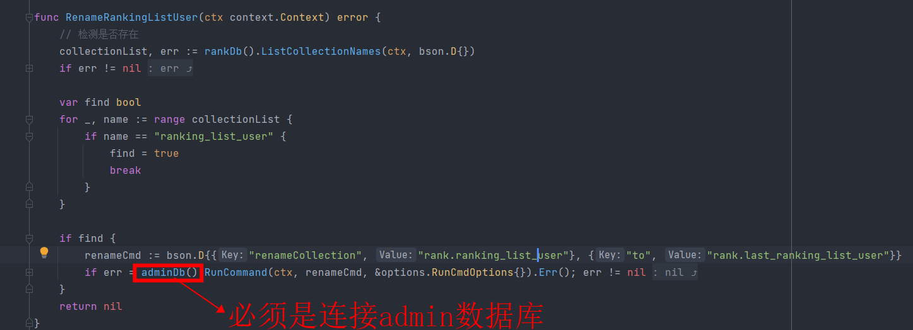
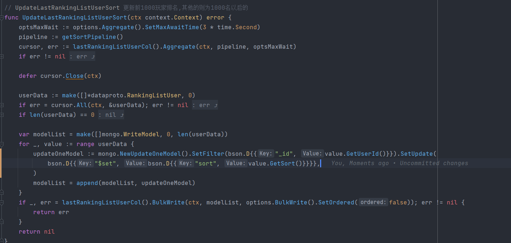
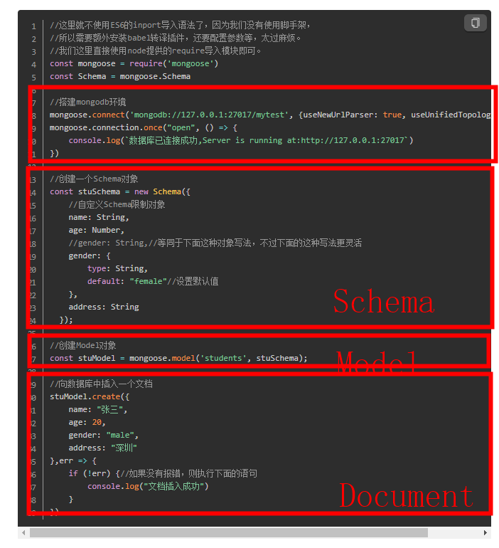

- # 特殊操作
	- ## 重命名collections集合
		- 先要检查数据库内是否包含该集合再执行修改
			- rankDb().ListCollections((ctx context.Context, filter interface{}, opts ...*options.ListCollectionsOptions)
		- 执行修改
			- adminDb().RunCommand(ctx context.Context, runCommand interface{}, opts ...*options.RunCmdOptions)
			- 
	- ## 批量更新数据
		- lastRankingListUserCol().BulkWrite(ctx context.Context, models []WriteModel,opts ...*opz``tions.BulkWriteOptions）
		- 
	- ## Schema、Model、Document
		- 
	- ## 连接数据库
		- ```
		  mongo -u 用户名 -p 密码 --port 端口号 --host ip 数据库名
		   
		  mongo ip:port/数据库  -u 用户名 -p 密码
		  
		  # 无用户名密码
		  mongo --port 27017 --host 127.0.0.1
		   
		  # 客户端连接 
		  mongodb://192.168.196.18:27017/?readPreference=primary&ssl=false&directConnection=true
		  ```
- # 常见数据操作
	- ## 操作数据库
		- 查看当前所在库
			- `db`
		- 切换数据库
			- `use databaseName`
		- 创建数据库
			- mongodb有一个特殊的机制，就是**隐式创建**；如果你想要创建一个数据库只需要：
				- `use databaseName`
		- 删除当前数据库
			- `db.dropDatabase()`
	- ## 操作集合
		- 创建集合
			- `db.createCollection('tableName')`
		- 查看所有集合
			- `show tables`
		- 删除集合
			- `db.tableName.drop()`
		- 重命名集合
			- `db.adminCommand({renameCollection: "db.collection1", to: "db.collection2"})`
		- 查看集合索引
			- `db.guild.getIndexes()`
		- 删除唯一索引
			- `db.guild.dropIndex("myIndex")`
		- 删除联合索引
			- `db.guild.dropIndex({ "index1": 1, "index2": 1 })`
	- ## 操作数据
		- 创建
			- insert 创建单条数据
				- `db.inventory.insert({ item: "journal", qty: 25, status: "A", size: { h: 14, w: 21, uom: "cm" }, tags: [ "blank", "red" ]})`
			- insertMany 批量创建数据
				- db.inventory.insertMany([
				     { item: "journal", qty: 25, status: "A", size: { h: 14, w: 21, uom: "cm" }, tags: [ "blank", "red" ] },
				     { item: "notebook", qty: 50, status: "A", size: { h: 8.5, w: 11, uom: "in" }, tags: [ "red", "blank" ] },
				     { item: "paper", qty: 10, status: "D", size: { h: 8.5, w: 11, uom: "in" }, tags: [ "red", "blank", "plain" ] },
				     { item: "planner", qty: 0, status: "D", size: { h: 22.85, w: 30, uom: "cm" }, tags: [ "blank", "red" ] },
				     { item: "postcard", qty: 45, status: "A", size: { h: 10, w: 15.25, uom: "cm" }, tags: [ "blue" ] }
				  ]);
			- insert 复合创建
				- ```
				  db.inventory.insert([
				     { item: "journal", qty: 25, status: "A", size: { h: 14, w: 21, uom: "cm" }, tags: [ "blank", "red" ] },
				     { item: "notebook", qty: 50, status: "A", size: { h: 8.5, w: 11, uom: "in" }, tags: [ "red", "blank" ] },
				     { item: "paper", qty: 10, status: "D", size: { h: 8.5, w: 11, uom: "in" }, tags: [ "red", "blank", "plain" ] },
				     { item: "planner", qty: 0, status: "D", size: { h: 22.85, w: 30, uom: "cm" }, tags: [ "blank", "red" ] },
				     { item: "postcard", qty: 45, status: "A", size: { h: 10, w: 15.25, uom: "cm" }, tags: [ "blue" ] }
				  ]);
				  ```
		- 查询
			- find 查全量
				- `db.inventory.find({})`
			- findOne 查询单个对象
				- ```
				  db.inventory.findOne({"item":"journal"}).status
				  
				  db.inventory.findOne({"item":"journal"}).size
				  
				  db.inventory.findOne({"item":"journal"}).size.h
				  ```
			- pretty 格式化查询
				- ```
				  db.inventory.find({}).pretty()
				  ```
			- find 按条件查询
				- ```
				  db.inventory.find({"status":"A"}).sort({"qyt":-1}).limit(2).pretty()
				  ```
		- 删除
			- remove 删除
				- ```
				  db.inventory.remove({_id:666001})
				  ```
			- update  unset删除指定字段
				- ```
				  db.package.update({_id:3},{$unset:{"emergency.content":""}})
				  ```
- ## 备份与恢复数据
	- mongodump -h IP --port 端口 -u 用户名 -p 密码 -d 数据库 -o 文件存在路径 
	  mongorestore -h IP --port 端口 -u 用户名 -p 密码 -d 数据库 --drop 文件存在路径
- ## 集合重命名
	- ```
	  // mongo集合重命名
	  // 必须以admin权限操作指定的  
	  // 数据库.old集合  to 数据库.new集合
	  db.getSiblingDB('admin').runCommand({ renameCollection: 'pvp.cur_season_user_data', to: 'pvp.cur_season_user_data_bak'})
	  ```