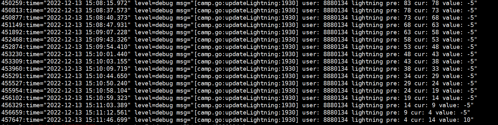

- 命令
	- ```
	  awk '{print $9, $NF}' /tmp/access_use.log.sort | grep  "[0-9][0-9](ms)" |head -n 165
	  
	  awk '{print $9, $NF}' /tmp/access_use.log.sort | grep  "[0-9][0-9](ms)" |head -n 165 | awk '{print $1}' | sort -n  | uniq -c | sort -nr -k1
	  ```
-
- demo1
	- # game 生成相关函数
	  grep "0x03" proto/cmd/cmd.proto  | grep "Event" | awk '{printf"\nfunc %s%s(user *User, in *serverproto.CommonRequest) error {\n\treq := &networkproto.%s{}\n\tif err := log.UnmarshalProto(in, req); err != nil {\n\t\treturn err\n\t}\n\n\t_ = req;\n\t// TODO\n\treturn nil\n}\n",tolower(substr($1,1,1)),substr($1,2),$6}'
# game 调用代码生成
 grep "0x03" proto/cmd/cmd.proto  | grep "Event" | awk '{printf"\tcase cmdproto.GameSerCmd_%s: // %s\n\t\terr = %s%s(user, in)\n", $1,$5,tolower(substr($1,1,1)),substr($1,2)}'
- 查询日志
	- 
	- // 以“value: ”分割的第二个字段使用gsub匹配双引号为空,然后对大于零的数求和
	  awk -F "value: " 'BEGIN{sum=0}{gsub(/"/, "",$2); if($2 > 0) sum+=$2; } END{print sum}' /tmp/8880134.log
- 查找game日志中请求时间超过500