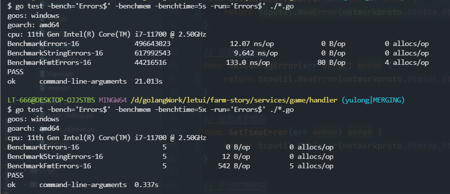
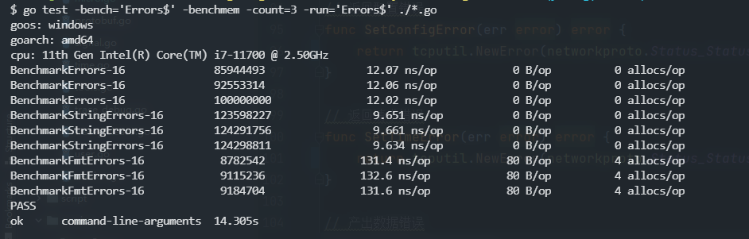
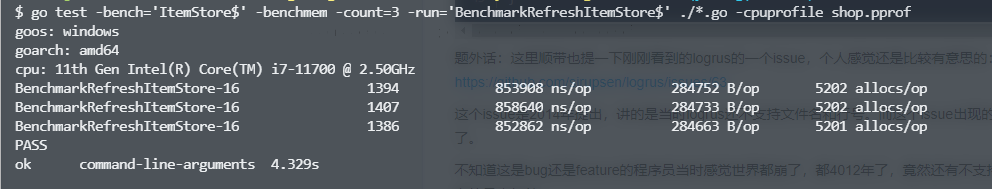

- ```
  // 单个测试
  // -run指定要调试以BenchmarkRefreshItemStore结尾的方法 + 所有依赖的包(*.go)
  go test -run=BenchmarkRefreshItemStore$ ./*.go
  
  
  // 性能测试
  // -bench指定运行以ItemStore结尾的方法  -run指定要调试以BenchmarkRefreshItemStore结尾的方法 + 调试方法所依赖的文件
  go test -bench=ItemStore$ -run=BenchmarkRefreshItemStore$ ./*.go 
  ```
- benchmark
	- -benchmem
		- 查看内存分配的情况
		- 
	- -benchtime
		- 表示时间5秒
			- -benchtime=5s
		- 表示次数5次
			- -benchtime=5x
		- 
	- -count
		- 参数可以用来设置 benchmark 的轮数
			- -count=3
		- 
	- 返回参数分析
		- 第二列参数指的是用例执行的次数
		- 第三列指的是每次花费时间
		- 第四列指的是分配多少内存
		- 第五列指的是分配了几次内存
		- 
		- ```
		  //---------cpu默认8核---------------执行次数-----------每次花费时间------------内存分配-----------分配了几次
		  BenchmarkRefreshItemStore-16         1394            853908 ns/op          284752 B/op       5202 allocs/op
		  ```