public:: false

- title:: review_lyj
- plunder
- match
	- 这中检测方式很巧妙，但是可能会增加一丢丢包的数据大小，其实影响也不是很大(如果这个切片更长就不建议这样的检测方式)
		- 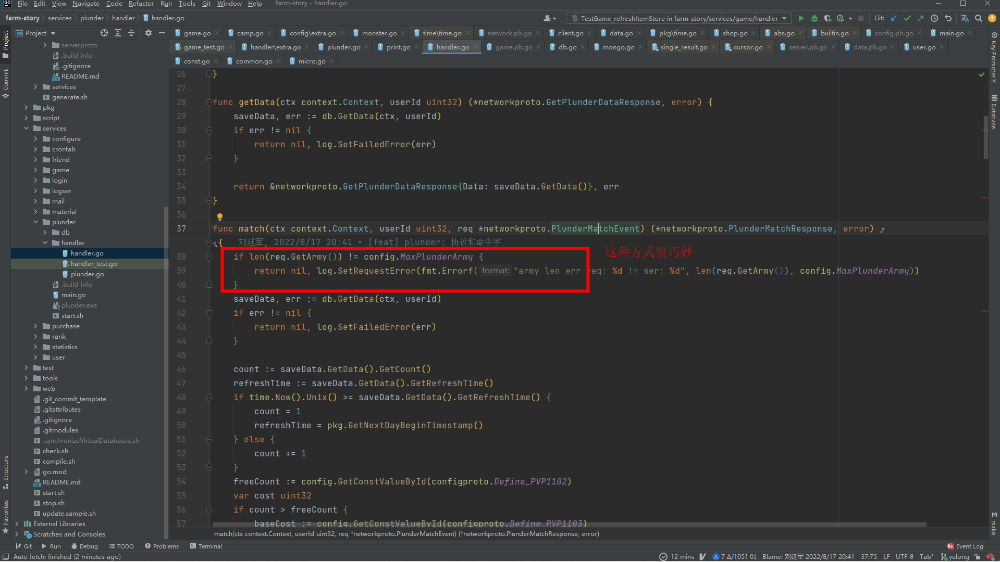
	- 没有特殊的用途，没必要为删除的数据单独处理
		- 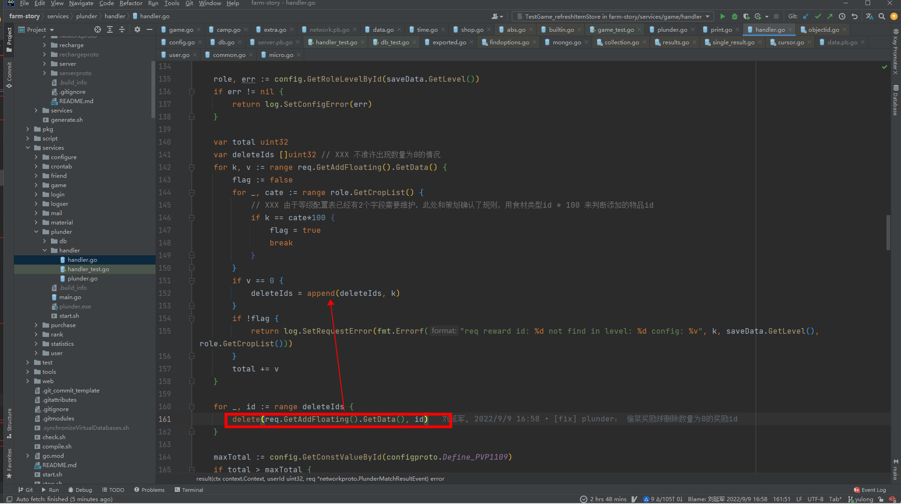
	- 变量重复定义
		- 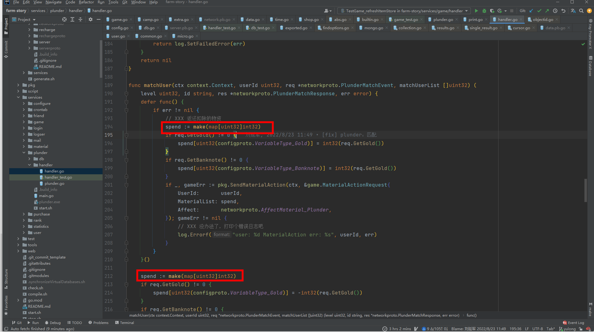
	- 如果并不是扣除物资那一步出错，这里会不会多加了物资
		- 可以给sendGamePlunder返回的错误加个标识
		- 建议更新物资不要放在game服务中
		- 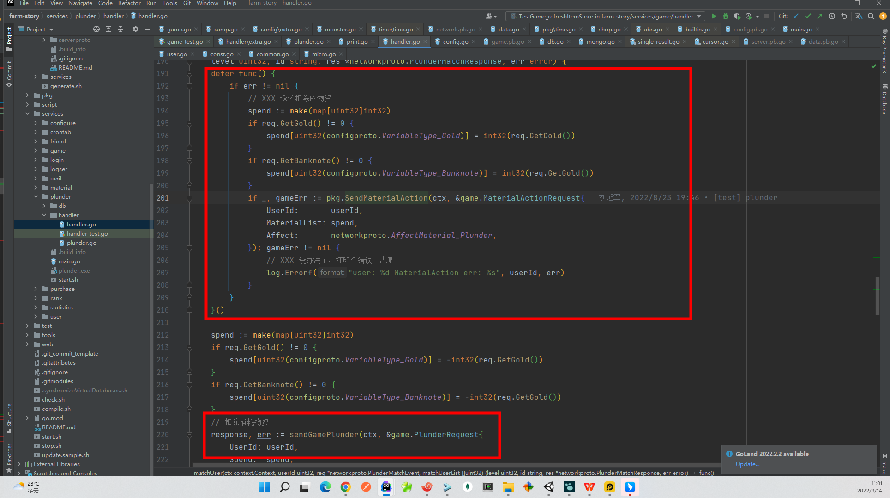
	- userId是否更合适一些
		- 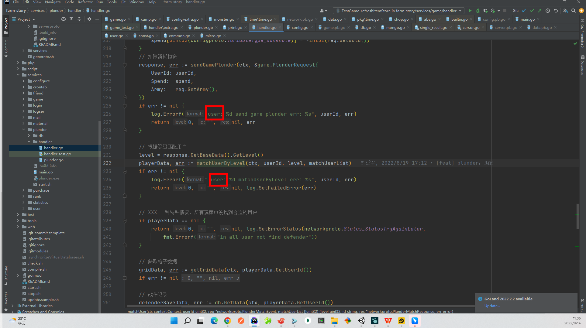
	- 直接给1就可以
		- 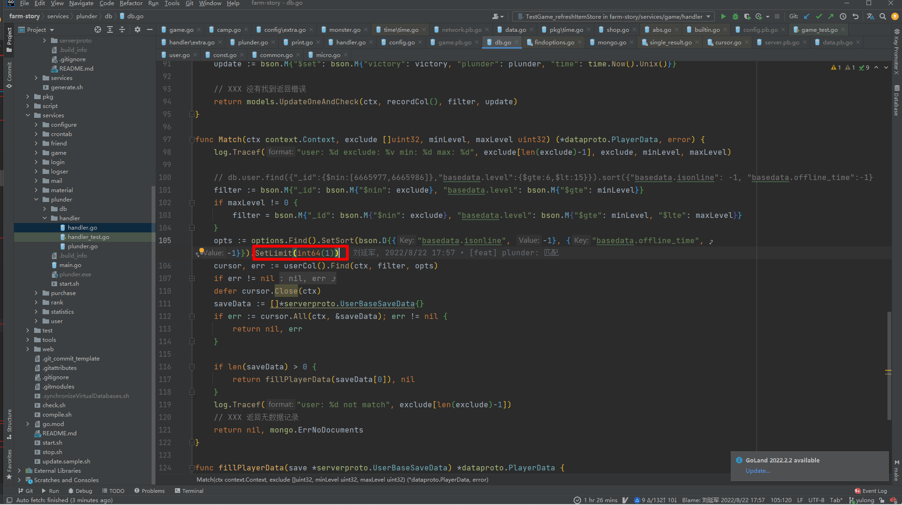
	- 参数传递的方式尽可能保持一致，建议最好先定义变量再传递
		- 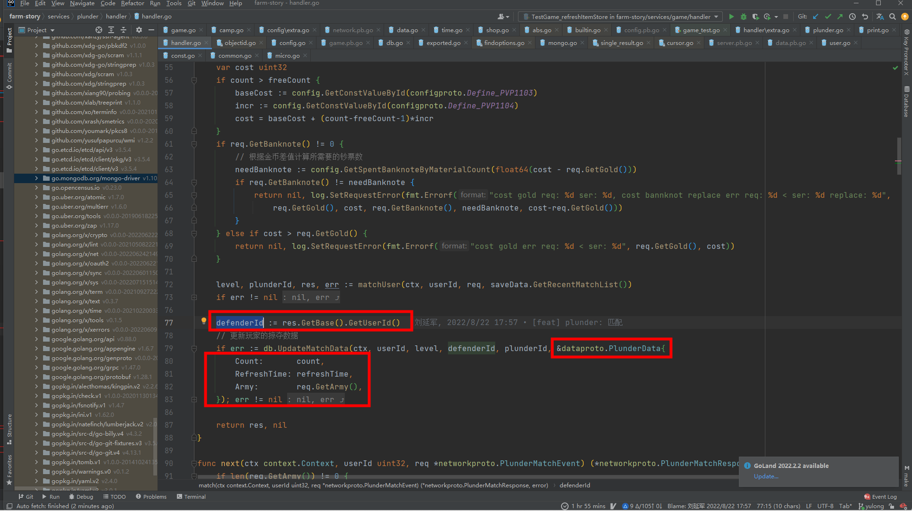
- purchase
- verifyOrder
	- 可以使用errors.New()代替fmt.Errorf(),fmt.Errorf()不带参数其实就是调用errors.New()
		- 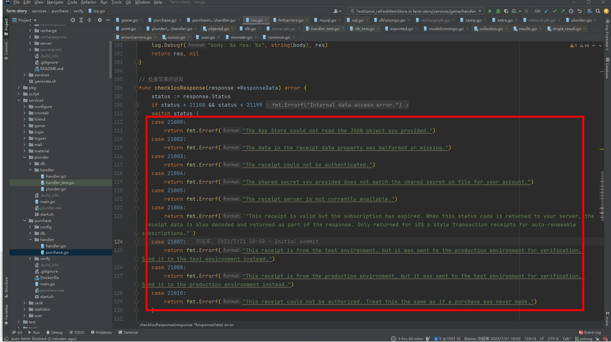
	- 已经是具名返回值，不需要对变量再次初始化
		- 还有一些类似的err变量的作用域问题
		- 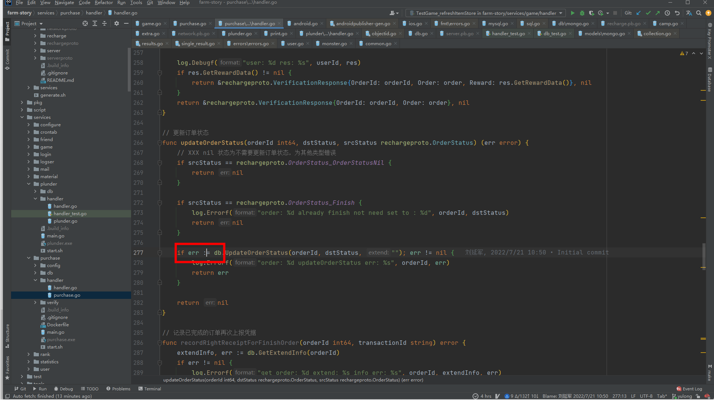
	- 变量命名和包名重复了，小心会出错
		- 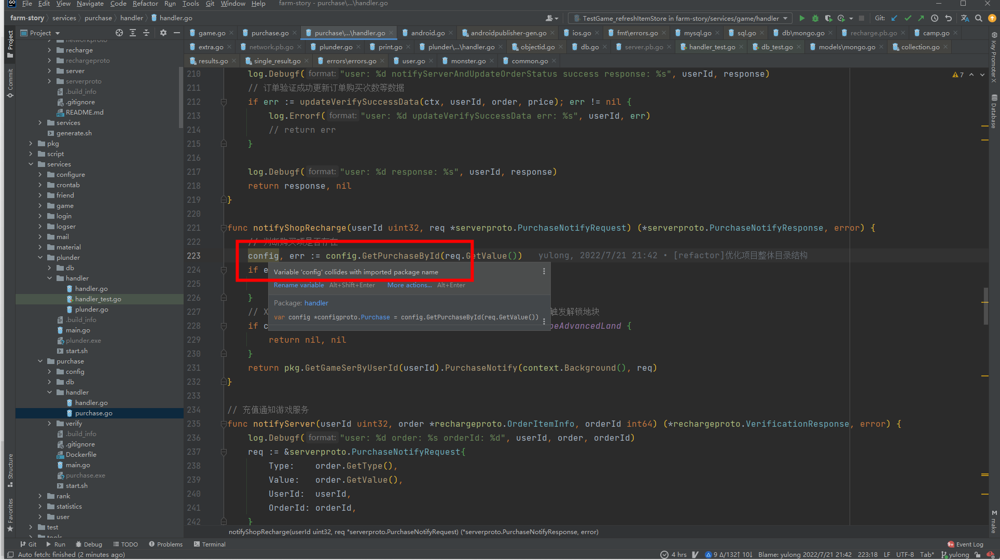
	- 这个判空应该可以去掉
		- 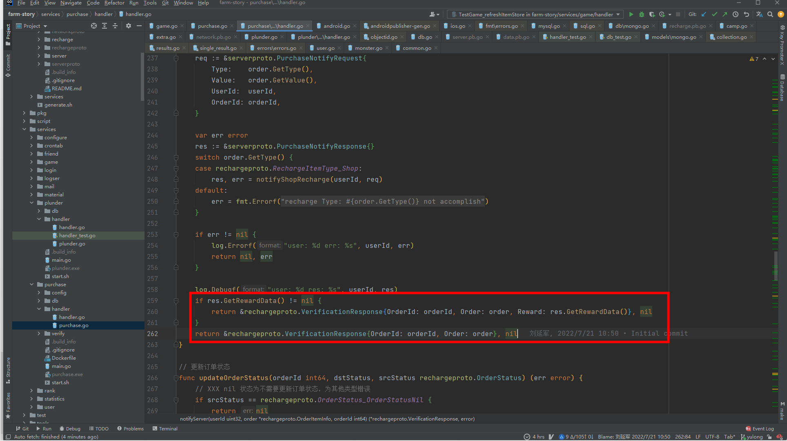
	- 这两个更新数据的错误处理方式可以保持一致
		- 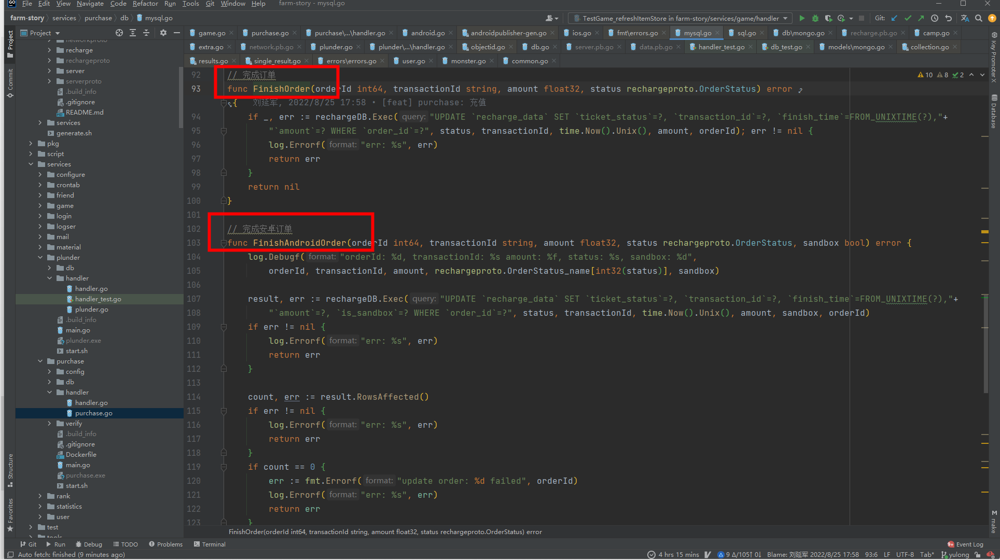
-