public:: true

	- 合成引导提示
		- 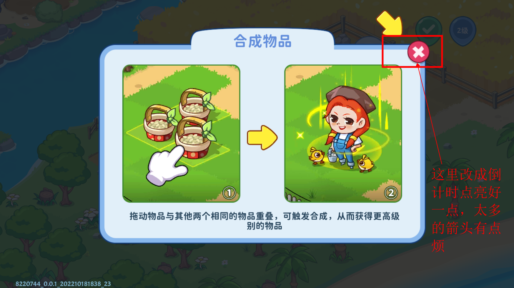
		- 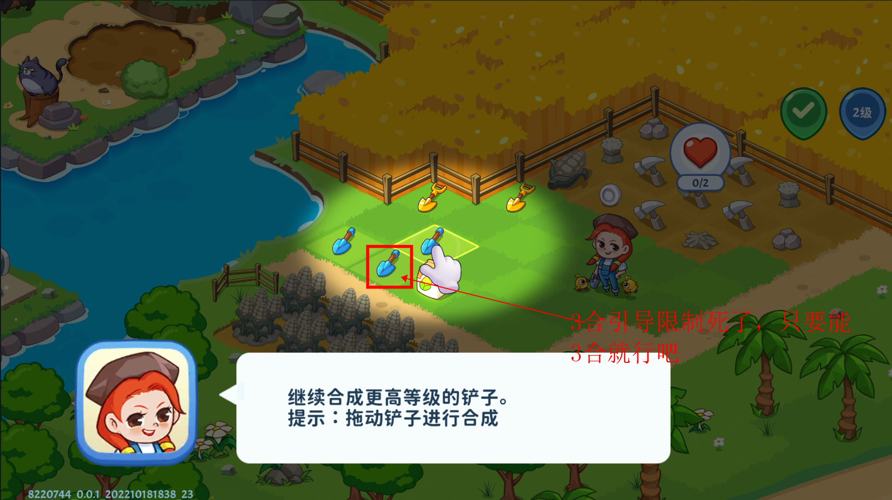
		- 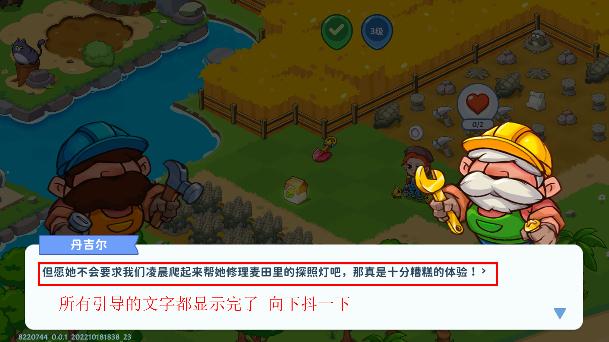
		- 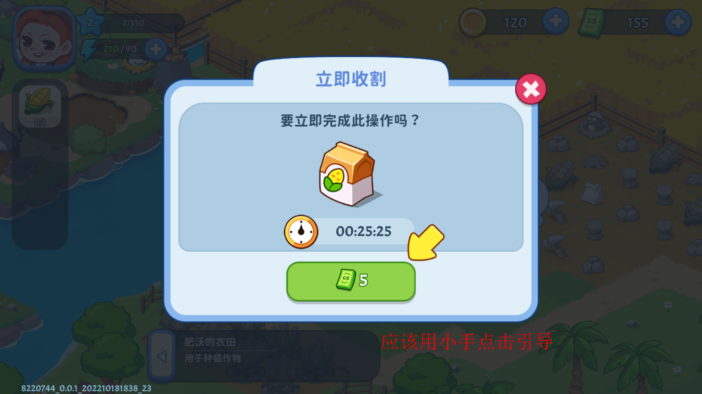
		- 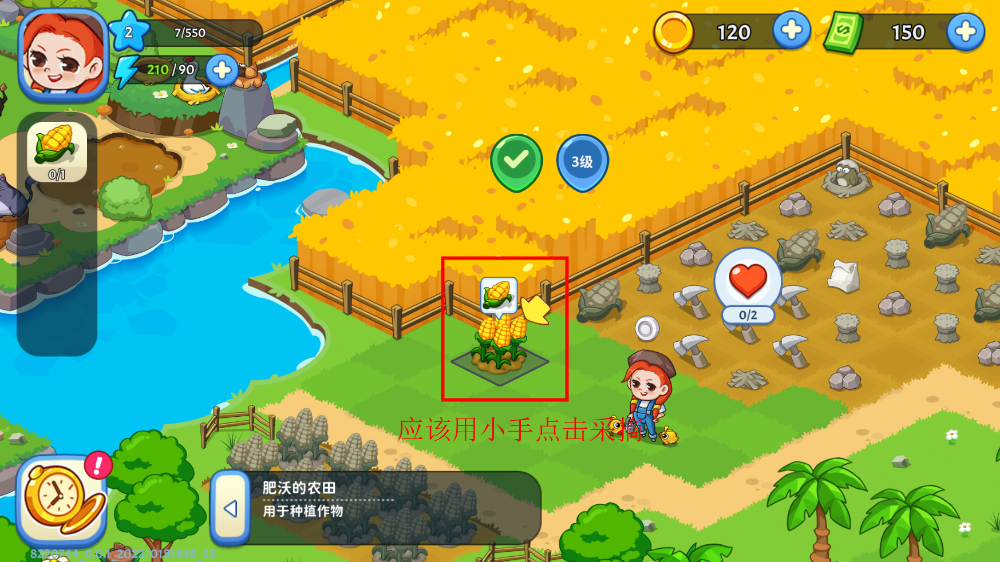
		- 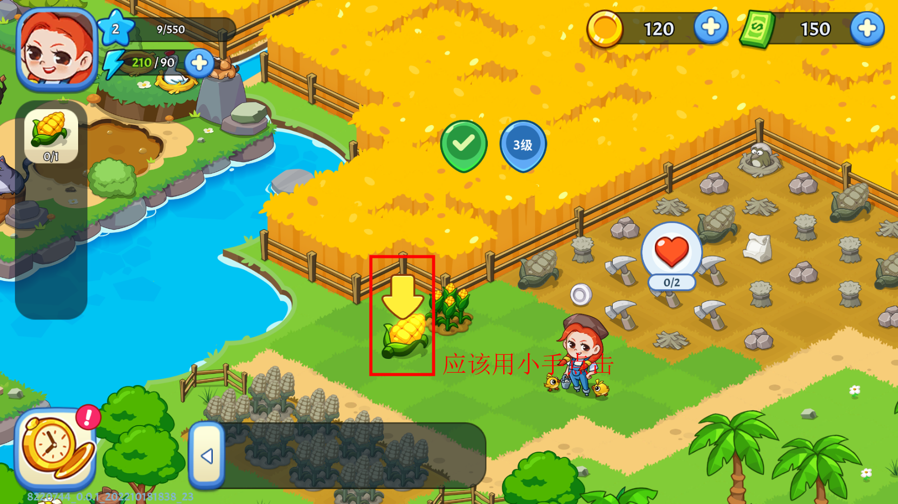
		- 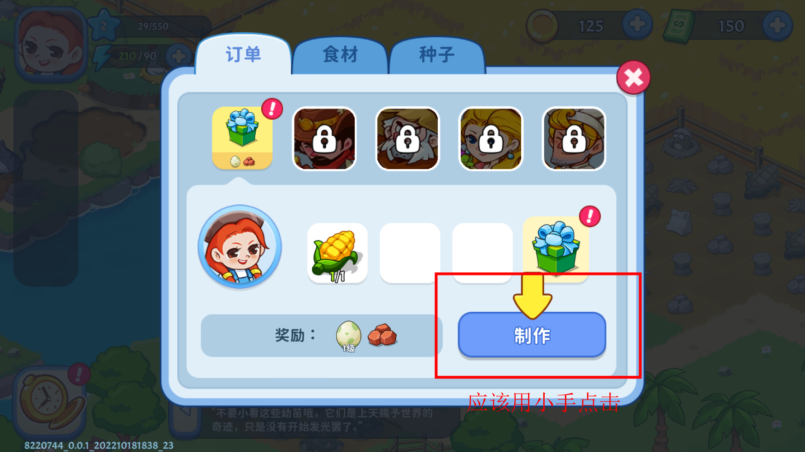
		- 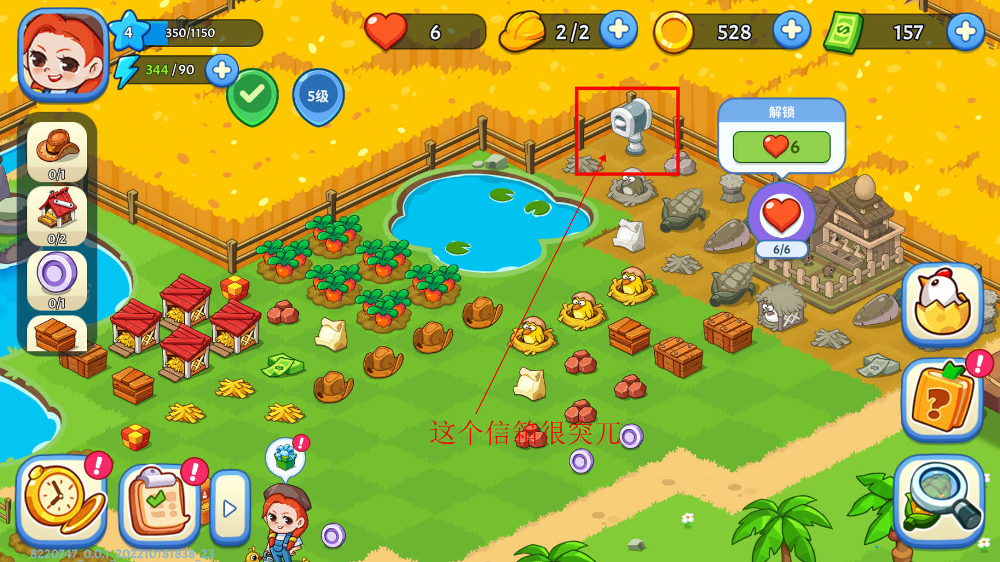
		- 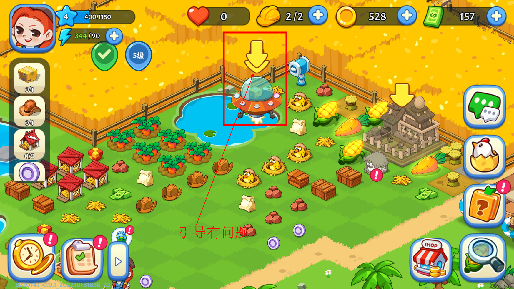
		- 
		- 
		- 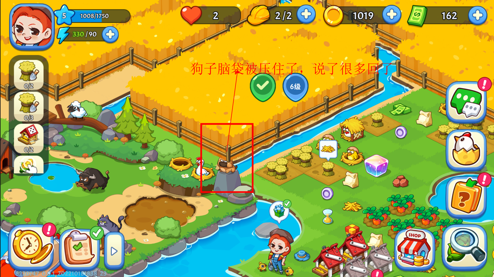
		- 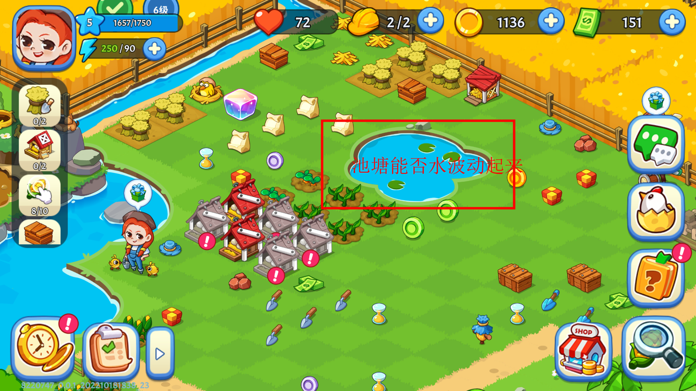
		- 引导的数量
			- 新玩家进入游戏的引导数量是否可以减少，只留下必要的引导，粗略的统计一下，截止到引导点击图鉴，玩家在屏幕上至少要点击七十次
				- 建议
					- 如5合工人，可以放在采集的时候，建议考虑优化
					- 合成农田播种收获的流程建议减少一点
		- 采集的引导
			- 两个资源上都显示采集箭头，必须两个都采集完了才能引导消失，有点烦
			- 然后合成两个建筑碎片的引导就很好，只要操作其中一个 另一个引导也就消失了
			- 建议
				- 采集和建造一样的引导逻辑
		- 2级如何升3级
			- 这块需要NPC产生礼盒释放生物，生物产出爱心值才能解地。但是前边只引导过一次解地  玩家不一定想得起来
			- 建议：
				- 再订单弹窗加上一些对订单产物作用的说明，再次强调
		- 生物箱引导
			- 每个生物上一个箭头，还以为是要点击
			- 建议
				- 做成合并物体的引导
				- 合并完生物希望画面缓缓的划过去，现在是突然的跳到栖息地 有些突兀
				- 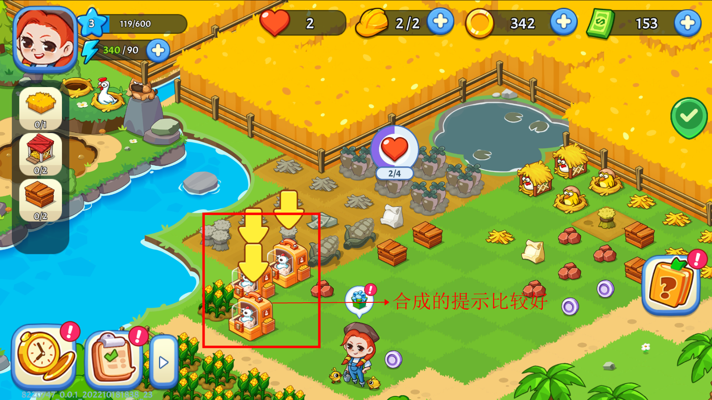
		-
		- 偷菜场景
			- 1、引导向下点击的箭头太多了
				- 建议
					- 只需要小手点击的引导即可
			- 2、偷菜结束通用载具停留在栖息地释放食材有点懵
				- 建议
					- 应该再游戏场地去释放食材
					- 有的食材没有呼吸效果，希望保持一致
		- 游戏和偷菜场景切换
			- 等待时间太长以为卡死了
			- 建议
				- 做一些简单的动画过渡可能好一些
				- 
		- 农田
			- 3级玩家，农田空着没有种子
				- 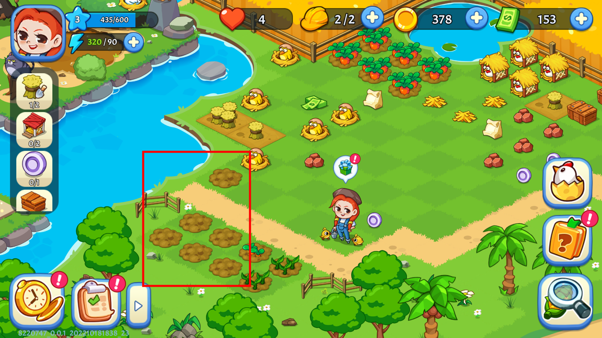
		- 体力引导问题
			- 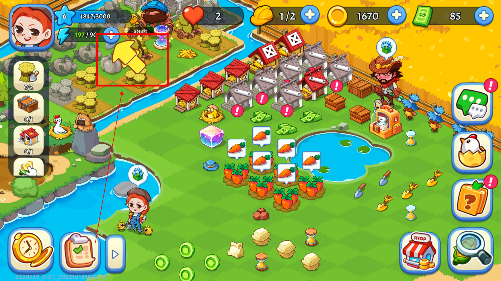