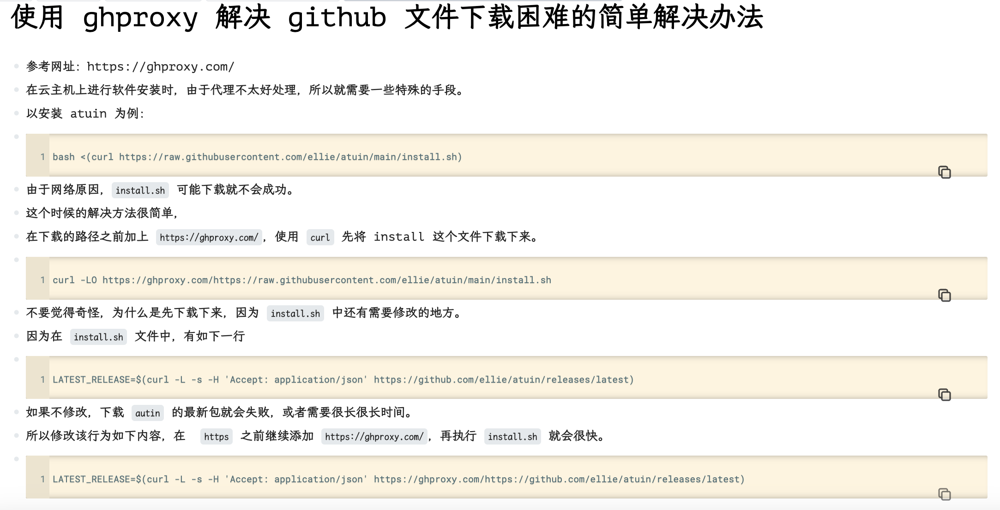

title:: autin.sh

- 官网
	- https://atuin.sh/docs/guide
	- ```
	  Atuin 是一个命令行工具，通过赋予 ctrl-r 超能力，使您能够更好地使用 shell,多端同步操作命令。
	  
	  您编写的每一行都会被存储 - 随时可以从您希望的任何机器上查询并再次运行。永远不会再忘记！
	  
	  在所有机器之间同步您的历史记录，并从任何地方搜索它
	  ```
- 