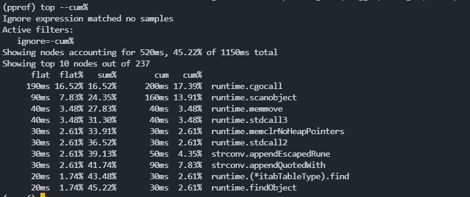
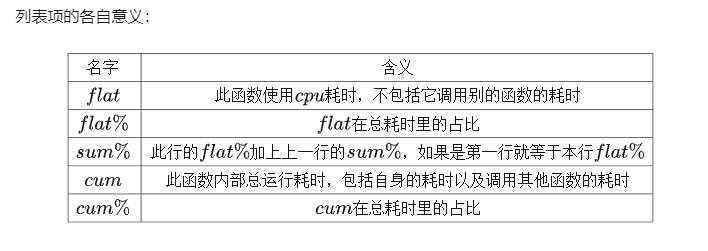
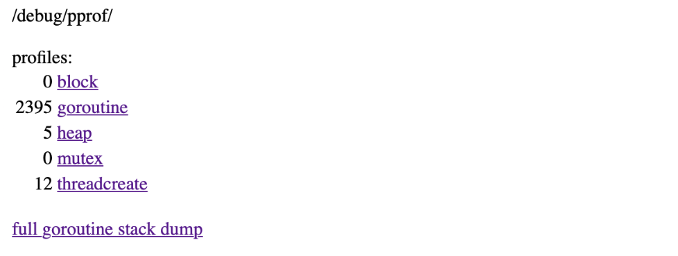
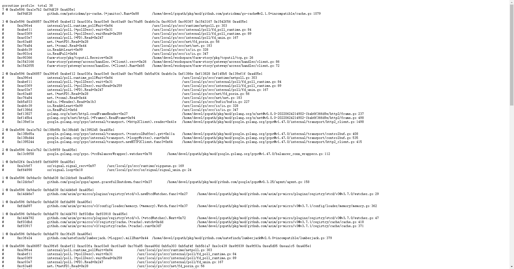
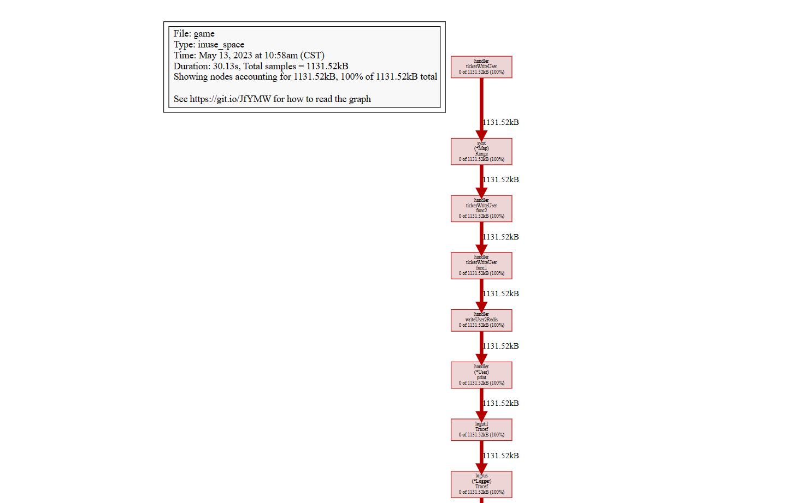

- # 命令行模式
- 错误及解决方案
	- 错误：Could not execute dot; may need to install graphviz.
	- 解决：需要安装graphviz
		- [graphviz-install-2.44.1-win64.exe](../assets/graphviz-install-2.44.1-win64_1665562461154_0.exe)
		- 安装后添加到环境变量
		  右键管理员身份打开cmd，进入目录：D:\Program Files\Graphviz 2.44.1\bin
		  执行：dot -c
- 调试
	- 生成pprof文件
		- ```
		  // 方法一
		  main函数加入以下两行
		  pprof.StartCPUProfile(os.Stdout)
		  defer pprof.StopCPUProfile()
		  然后执行如下
		  go run main.go > main.pprof
		  
		  // 方法二
		  // -bench指定运行以ItemStore结尾的方法  -run指定要调试以BenchmarkRefreshItemStore结尾的方法 + 调试方法所依赖的文件 + -cpuprofile + 指定输出的pprof文件名
		  go test -bench=ItemStore$ -run=BenchmarkRefreshItemStore$ ./*.go -cpuprofile game.pprof
		  ```
	- 调试pprof文件
		- 命令行终端分析
			- 常用命令
				- ```
				  top：默认按flat排序显示前10个
				  traces：显示所有的调用栈
				  list：列出代码详细的信息。
				  ```
			- go tool pprof test.go  test.pprof
				- 指定查看前10个
					- top10
				- 按照cum%排序
					- top  --cum%
		- 浏览器分析,随意指定一个端口
			- go tool pprof  -http=:9999  test.pprof
			- 
	- 参数解析
		- 
-
- # web模式
	- ## 方式1
		- ```
		  package main
		  
		  import (
		  	"fmt"
		  	"net/http"
		  	_ "net/http/pprof"
		  )
		  
		  func main() {
		  	// 开启pprof，监听请求
		  	ip := "0.0.0.0:6060"
		  	if err := http.ListenAndServe(ip, nil); err != nil {
		  		fmt.Printf("start pprof failed on %s\n", ip)
		  	}
		  }
		  ```
		- 可以通过http://localhost::6060/debug/pprof查看主页
			- ```
			  block：goroutine的阻塞信息，本例就截取自一个goroutine阻塞的demo，但block为0，没掌握block的用法
			  goroutine：所有goroutine的信息，下面的full goroutine stack dump是输出所有goroutine的调用栈，是goroutine的debug=2，后面会详细介绍。
			  heap：堆内存的信息
			  mutex：锁的信息
			  threadcreate：线程信息
			  ```
			- 
		- url请求中设置debug=1：
			- http://192.168.196.18:11181/debug/pprof/goroutine?debug=1
			  
			  // 下图解析
			  goroutine profile: total 38   // 表示的是gorutine的数量
			  7 @ 0xa0e596 0xa1e7b2 0xf9df29 0xa405e1   //表示的是其中有7个gorutine运行再当前调用栈,并且停在相同位置
			  0xf9df28	github.com/patrickmn/go-cache.(*janitor).Run+0x88	/home/devel/gopath/pkg/mod/github.com/patrickmn/go-cache@v2.1.0+incompatible/cache.go:1079  // 表示当前gorutine的调用栈,列出了函数和所在文件行数
			- 
		- url请求中设置debug=2：
			- ```
			  http://192.168.196.18:11181/debug/pprof/goroutine?debug=1
			  
			  // 下图解析
			  goroutine 9 [select, 2 minutes]：9是goroutine id，[]中是当前goroutine的状态，阻塞在写channel，并且阻塞了2分钟，长时间运行的系统，你能看到阻塞时间更长的情况。
			  ```
			- 
	- ## 方式二
	- 查看svg图
		- 给予方式一，生成 access_heap.out 文件
			- ```
			  #第一步：生成.out文件
			  curl http://192.168.196.18:8016/debug/pprof/heap?seconds=30 > /tmp/access_heap.out
			  #第二步：下载到本地
			  sz /tmp/access_heap.out
			  #第三步: 在本地的access_heap.out文件同目录下执行
			  go tool pprof access_heap.out
			  #第四步：输入命令 web
			  即刻跳转到浏览器查看内存svg分布图
			  ```
		- 
-