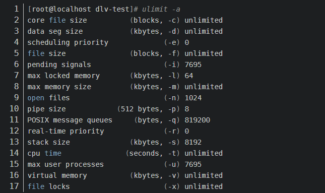

- ulimit -a：用来显示当前的各种用户进程限制。
	- 可以看到core file size (blocks, -c) 0产生core文件限制是0，就是不能产生core文件，所以需要将这个限制修改：ulimit -c unlimited。
	- 
- 要想让Go程序能产生core dump文件，需要配置GOTRACEBACK环境变量：
	- export GOTRACEBACK=crash或者在执行程序时指定
- 调试命令：
	- 使用当前编译的文件及core文件：dlv core  ./game  ./core.game.5121