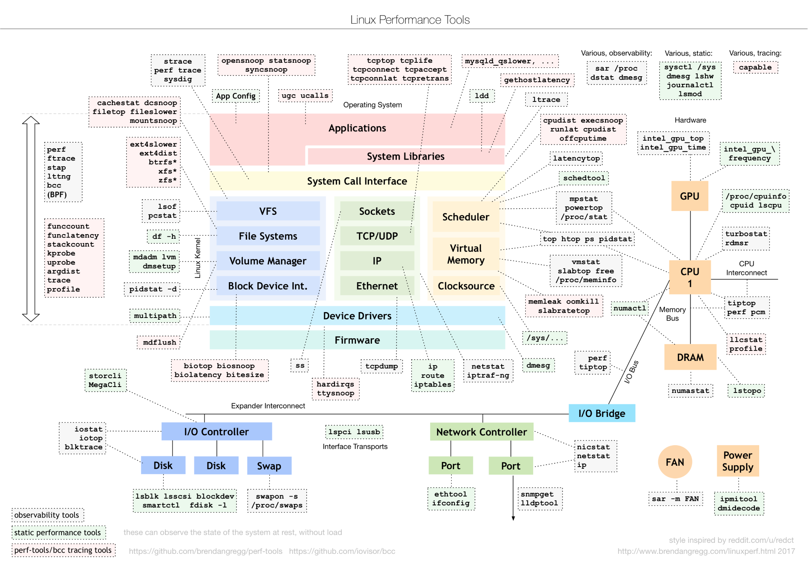

# 学习内容

# 新人培养计划

在自己的 github 上创建学习 Go 的相关工程，提交自己的 demo 程序

## Go 语言基础

读完《Go 程序设计语言》或者看完视频《Google 资深工程师深度讲解 Go 语言》

[2、2018 Google资深工程师深度讲解Go语言/](http://192.168.196.20/pub/%E5%88%98%E5%BB%B6%E5%86%9B/2%E3%80%812018%20Google%E8%B5%84%E6%B7%B1%E5%B7%A5%E7%A8%8B%E5%B8%88%E6%B7%B1%E5%BA%A6%E8%AE%B2%E8%A7%A3Go%E8%AF%AD%E8%A8%80.zip)

[The-Golang-Standard-Library-by-Example/directory.md at master · polaris1119/The-Golang-Standard-Library-by-Example](https://github.com/polaris1119/The-Golang-Standard-Library-by-Example/blob/master/directory.md)

### context

### 进阶 必须看

[http://192.168.196.20/pub/刘延军/159-Go 并发编程实战课/](http://192.168.196.20/pub/%E5%88%98%E5%BB%B6%E5%86%9B/159-Go%20%E5%B9%B6%E5%8F%91%E7%BC%96%E7%A8%8B%E5%AE%9E%E6%88%98%E8%AF%BE/)

在线书籍

[Go语言入门书籍（98%25推荐）/](http://192.168.196.20/pub/server/go/)

### 优秀博客

https://qcrao.com/

https://draveness.me/

https://lessisbetter.site/

https://changkun.us/

https://dave.cheney.net/

## Redis

熟悉 string，hash 相关的常见命令

熟悉 del, expire，info, keys，type 等通用命令

了解 list, set 和 有序集合的相关命令

使用 github.com/go-redis/redis 库操作 string 和 hash 类型的数据

[http://www.redis.cn/](http://www.redis.cn/)

[https://www.bilibili.com/video/BV1S54y1R7SB?from=search&seid=9620528018887102483](https://www.bilibili.com/video/BV1S54y1R7SB?from=search&seid=9620528018887102483)

## MongoDB

使用 mongo 官方库：go.mongodb.org/mongo-driver/mongo

完成基本的增、删、改、查 demo

[https://www.bilibili.com/video/BV1NW411T7vT?from=search&seid=17159768433544228492](https://www.bilibili.com/video/BV1NW411T7vT?from=search&seid=17159768433544228492)

[https://live.csdn.net/list/wl5875](https://live.csdn.net/list/wl5875)

《MongoDB权威指南》 微信读书有免费最新版

## MySQL

使用 sqlx 库 能完成基本的增、删、改、查操作 demo

[https://www.bilibili.com/video/BV1Vy4y1z7EX?from=search&seid=736254730168163182](https://www.bilibili.com/video/BV1Vy4y1z7EX?from=search&seid=736254730168163182)

[https://search.bilibili.com/all?keyword=mysql&from_source=webtop_search&spm_id_from=333.788&order=click&duration=4&tids_1=0](https://search.bilibili.com/all?keyword=mysql&from_source=webtop_search&spm_id_from=333.788&order=click&duration=4&tids_1=0)

"[github.com/jmoiron/sqlx](http://github.com/jmoiron/sqlx)"

## Linux 基本操作

熟悉 awk, sed, ls, uniq, wc, ip 等命令

能使用 vim 快速修改配置文件，或者修改代码中的问题

vim

du/df/glances

cp, rm, mv

tar zip/unzip

bash shell

find/awk/grep/sed/sort/uniq/cut

文件权限管理

https://man.linuxde.net/

https://www.cnblogs.com/h2mm/p/6691309.html

crontab

ping/telnet/scp/ifconfig/

lsof

kill/killall

xargs

exec

https://blog.csdn.net/yy150122/article/details/106146414

gdb

dlv 调试Golang

tmux

glances

《鸟哥的linux私房菜》

[史上最牛的Linux视频教程—兄弟连](https://www.bilibili.com/video/BV1mW411i7Qf?from=search&seid=16764109724591826525)

## 其它组件

### git 常用操作

熟悉拉取，提交，推送，创建分支，合并代码等

子仓库 、cherry-pick 、stash

[https://www.ruanyifeng.com/blog/2015/08/git-use-process.html](https://www.ruanyifeng.com/blog/2015/08/git-use-process.html)
[git实战课堂笔记.pdf](http://192.168.196.20/pub/%E5%88%98%E5%BB%B6%E5%86%9B/git%E5%AE%9E%E6%88%98%E8%AF%BE%E5%A0%82%E7%AC%94%E8%AE%B0.pdf) （[https://www.bilibili.com/video/BV1vY411c7Zp?spm_id_from=333.337.search-card.all.click](https://www.bilibili.com/video/BV1vY411c7Zp?spm_id_from=333.337.search-card.all.click)）

### protobuf

熟悉 Go 语言如何操作 protobuf, Goland 有 protobuf 插件

[https://segmentfault.com/a/1190000020444017](https://segmentfault.com/a/1190000020444017)

[https://geektutu.com/post/quick-go-protobuf.html](https://geektutu.com/post/quick-go-protobuf.html)

[https://colobu.com/2019/10/03/protobuf-ultimate-tutorial-in-go/](https://colobu.com/2019/10/03/protobuf-ultimate-tutorial-in-go/)

### markdown 语言

熟悉基本 markdown 语法，推荐工具：typora、logseq

### 其他

kafka、zookeeper、etcd、go-micro-v3

### Goland 插件推荐

- Translation
- Rainbow
- Gopher
- Protocol buffers
- IdeaVim
- wakatime 统计编码时长的工具

### 浏览器

推荐 Edge

## 编码规范

[https://github.com/xxjwxc/uber_go_guide_cn#uber-go-语言编码规范](https://github.com/xxjwxc/uber_go_guide_cn#uber-go-%E8%AF%AD%E8%A8%80%E7%BC%96%E7%A0%81%E8%A7%84%E8%8C%83) [https://zhuanlan.zhihu.com/p/86410535](https://zhuanlan.zhihu.com/p/86410535)

### 部分推荐软件内网下载链接

[推荐软件](http://192.168.196.20/pub/software/%E5%B8%B8%E7%94%A8%E8%BD%AF%E4%BB%B6%E6%8E%A8%E8%8D%90/)

### 其他学习数据和视频

[http://192.168.196.20/pub/server/](http://192.168.196.20/pub/server/)

[http://192.168.196.20/pub/刘延军/](http://192.168.196.20/pub/%E5%88%98%E5%BB%B6%E5%86%9B/)