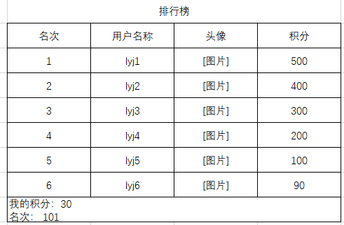

# 小科目

# 目的

​	（开发本项目前，需要学习  go 语言、Mysql、Redis 、MongoDB、protobuf 、Linux、git、http等）

​	1、考察对 go 语言、Mysql、Redis 、MongoDB、protobuf 、Linux等的掌握情况；

​	2、了解服务端工作内容，需求分析->设计存储协议和服务架构->功能开发->项目部署；

​	3、学习需求分析，简单的技术选型等（这么高大上都是瞎说的）；

​	4、计划时间（最长2周，包括所有功能开发完毕，并review完成）；


### 注：本项目不作为考核标准，仅作为学习和对部分知识掌握情况的一种考察。


# 项目介绍

​		我们给项目起个名称，叫做《消消闯关卡》。是一个三消类的小游戏，通过消除来完成完成任务，最终完成闯关。

​		当玩家注册成功后，进入"我的家园"，里面有各种功能按钮，如：关卡、好友、排行榜、商店、设置、仓库等功能模块。

​		目前开发的功能有关卡、好友、排行榜。

​		关卡：玩家创建成功后，初始为第一关，目前开放到5关（包含）。每关最多有3个任务，每完成一个任务，奖励一定的积分，具体奖励查看任务表，当3个任务全部完成，闯关成功，奖励一定的积分，具体查看关卡表，并解锁下一关。如果玩家完最后一关，不能进行下一关，需要提示"您已经挑战完成所有开放的关卡，其他关卡敬请期待......"，完成最后一关，玩家 当前关卡记录为最后一关+1。（关卡地图有客户端随机生成，任务完成也由客户端来判断，服务端完全相信客户端）

​		排行榜：可以查看所有玩家的积分排行。需要显示玩家、头像名称，积分。

​		好友：可以查看好友名称、头像、积分、是否在线（或者下线时时间）（后期扩展私聊功能）

#### 关卡表 level.json

id：关卡id;

task_list：任务列表，当前关卡包含的任务;

finish_reward： 完成关卡奖励的积分；

```json

{
    "list": [
        {
            "id": 1,
            "task_list": [
                101
            ],
            "finish_reward": 10
        },
        {
            "id": 2,
            "task_list": [
                101,
                102
            ],
            "finish_reward": 10
        },
        {
            "id": 3,
            "task_list": [
                101,
                102,
                103
            ],
            "finish_reward": 10
        },
        {
            "id": 4,
            "task_list": [
                101,
                102,
                103
            ],
            "finish_reward": 10
        },
        {
            "id": 5,
            "task_list": [
                101,
                102,
                103
            ],
            "finish_reward": 10
        }
    ]
}
```

#### 任务表 task.json

id：任务id;

reward_score： 完成任务奖励积分；

~~~json
{
    "list": [
        {
            "id": 101,
            "reward_score": 1
        },
        {
            "id": 102,
            "reward_score": 2
        },
        {
            "id": 103,
            "reward_score": 3
        }
    ]
}
~~~


# V1版本

### 策划需求：

​		玩家通过设备唯一标识进行注册，注册完成后返回账号和密码，初始；

​		玩家可以通过账号和密码进行登陆，如果账号或者密码错误，不准许登陆，提示“账号或密码错误，请输入正确的账号和密码“，账号最少8位，前俩位为随机的大写字母，后6位为数字，随机密码为小写字母和数字的组合，长度为4位。账号前缀随机时，去掉大写i （I）、大写的o（O)，密码随机时，去掉小写的l和小写的o以及数字0；

​		当登陆成功，进入“我的家园”，提示玩家给自己设置昵称，并选择性别；

​		点击关卡，进入关卡（初始关卡为1），当完成任务（无顺序），读取任务表配置增加积分；当所有任务完成，闯关成功，读取关卡表增加奖励积分，并解锁下一关；

​		点击排行榜，返回根据积分排名的前50名用户数据，并包括当前请求用户的排名；

​	



​	


​		

### 设计要求：

​		完成用户注册、登陆、上下线消息处理；

​		完成关卡相关功能；

​		完成排行榜，

​		使用 Redis 做缓存，Mysql 做数据持久化处理；

​	

​	提示：

​				用mysql 的自增id来创建唯一的用户id，账号可以用xx+用户id来表示，复杂的protobuf存储可以使用mysql的blob类型来存储；

​				（查询速度，设置mysql的索引）

​				redis使用hash 、zset等

### 需求分析：

​		用户通过设备唯一id注册（设备唯一id，可以用任何不为空的字符串代替）

​		用户登陆（账号+密码）

​		请求用户数据

​		设置用户昵称（如果用户有昵称，则不准许重复设置）

​		进入关卡

​		完成任务

​		完成关卡

​		排行榜获取


### 以下协议仅供参考。某先地方设计可能不合适，可以去修改

```go
// 账号数据
message AccountData {
	int userId = 1;
	string	account = 2; 
  	string passwd = 3 ;
  	string equipmentId = 4; // 设备id
}

// 用户基础数据
message BaseData {
    int userId                  = 1; // 用户id
    string nickname             = 2; // 用户昵称
    string avatarURL            = 3; // 第三方头像链接
    uint64 score                = 4; // 积分
    bool isOnline               = 6; // 是否在线
    int64 offlineTime           = 7; // 离线时间
}

// 用户的游戏数据 （还有其他数据，数据比较大）
message GameData {
	LevelData levelData				= 1; // 关卡数据
    map<uint32,uint32> shopData     = 2; // 商店
    StatisticsData statistics       = 3; // 统计数据
    GameSetting setting             = 4; // 游戏设置
    MaterialData material           = 5; // 货币物资数据
}

// 关卡数据
message LevelData {
    uint32 curLevel                 = 1; // 当前关卡id
    repeated uint32 finishTask      = 2; // 当前关卡完成任务id
}

// 统计类类数据
message StatisticsData {
    int64 totalOnlineTime                   = 1; // 总在线时长(下线更新)
    uint32 totalUseMoney                    = 2; // 总消耗金币
    uint32 totalUseStar                     = 3; // 总消耗星星
    uint32 totalExposureHeat                = 4; // 总曝光度热度 （消耗积分增加曝光度，每次随机一个热度)
}

// 游戏配置
message GameSetting {
    uint32 switch               = 1; // 位标志 1:连续合成 2:重叠合成 3:点击确认
}

message MaterialData {
    int32 money                     = 1; // 金币
    uint32 star                     = 2; // 星星
    map<uint32, uint32> warehouse   = 3; // 仓库(场外道具)
    uint32 exposureMoney            = 4; // 曝光货币
}
```

# V2版本

### 策划需求：

 		在上个版本，排行榜用户为全部用户，由于不活跃的高积分用户会持久占榜，新玩家久久不能上榜。排行榜需求进行修改，每月1号开始，将这个月积分有变更的用户进行排行，下月1号0点清空上个月的排行，从新开始排。

### 程序需求

​		由于之前redis缓存为所有用户，当用户注册量到到一定的量是，redis的内容占用过高，经分析发现存有大量不活跃的用户（31天以上未登陆过的用户）。现在需求给redis中的用户设置缓存时间，如果超过31天未登陆，则从redis中清除。（每个月最多31天，考虑可能1号活跃，之后一直未活跃，进而导致31号找不到数据问题）

##### 注意：

​		用户回归的处理。

# # V3版本

### 策划需求：

​		好友功能的开发，好友页面展示好友列表，包括姓名、头像、性别、积分、是否在线或者下线时间。

​		搜索好友：在好友列表搜索框中输入用户昵称进行搜索，搜索为全匹配，即输入内容和用户名称完成相等是，将这些（可能多个，可能一个）匹配到的用户显示在搜索列表，展示内容包括：姓名、头像、性别、积分、是否在线或者下线时间。

​		好友搜索优先：

​				A.  从当前在线玩家中搜索

​				B.  从7天内活跃过的玩家中搜索

​		好友推荐：根据用户注册是的国家，随机给用户推荐和自己相同国家且积分大于自己的用户，每次5个，如果相同国家的用户数量不足，用其他国家的用户填充。

​		添加好友：在搜索和推荐的用户列表中，可以右击申请添加好友，申请经过玩家同意后添加成功。好友的上限是30人。

​		删除好友时，不需要对方确定，删除后双方都无法看到对方。如AB互为好友，A将B删除后，A的好友列表中没有B，B的好友列表也没有A。打开界面时刷新数据。

​		好友申请：相同用户id的保留一条，最多保留20条

​		可以参考：好友.docx 文档进行开发（部分未涉及到的功能不需要开发，这是一个真实的案子哦）

### 程序需求：

 		因为redis保存活跃用户的数据，不活跃的用户需要从mysql中获取，在填充好友基础数据下发客户端时，需要从redis和mysql（或者全部从mysql)中获取数据。从性能和逻辑的复杂度讲，这是一种不合适的设计，根据目前情况，我们需要对此进行优化。

​		方案一：mongo为文档形数据库，支持大量的的存储，在扩展和性能方面，都是不错的一种选择。我们引入了mongo做为存储，将玩家部分或者全部数据放任mongo中。

​		其他方案：可以自由发挥，说出这样的好处，并实现。


# 最终版

​		根据前3个版本进行整体要求：

​		1、对应GameData，必须使用redis做缓存、mysql做数据持久化；~~（或者全部用mongo做持久化）~~

​		2、使用日志库，打印必要的日志，日志文件要求：轮询、可设置日志级别，每行必须打印时间；

​		3、必要的测试用例和对接文档；

​		4、实现配置文件的热更新；

​		