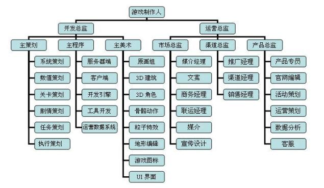

# 游戏团队介绍-服务端工作内容

# 游戏分类

[从无到有：电子游戏的分类](https://www.gameres.com/795121.html)

[游戏分类大赏](https://zhuanlan.zhihu.com/p/22745932)

# 游戏的生命周期

定项→确定案子→需求分析→对接→测试→部署上线→ 停止运营

策划、客户端、美术、测试、运营、服务端 怎么一起配合工作的？

# 游戏团队构成

# 服务端的工作内容

服务端的开发、部署、运维

前后端分离

## 服务端开发工具

### 开发

golang

goland、vim

redis、mongo、mysql

kafka、zookeeper、etcd

### 部署和运维

linux

vim

grep/losf

等等

### 游戏团队组成

[游戏开发团队都需要哪些职位以及人员配备？-人员配备,职位,团队,游戏](https://wukong.toutiao.com/question/6804634057356345613/)

****游戏相关岗位，有哪些选择？****

[游戏相关岗位，有哪些选择？](https://www.zhihu.com/question/386135215)

[游戏公司岗位有哪些？各职位都是做什么的？有什么特点？_次世代3D游戏建模的博客-CSDN博客](https://blog.csdn.net/JM3Dmax/article/details/107333652)